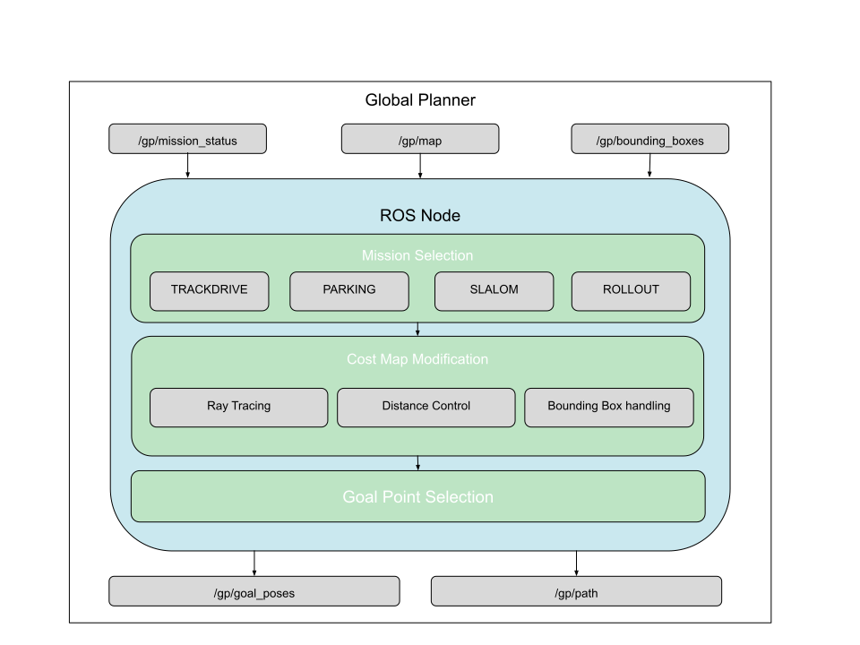

# Global Planner
This is the Tufast Global Planner. It's purpose is to interpret the observed sensor data, and use it to solve one of serveral pre defined drive tasks.
## General Architecture


## Missions
The Global Planner can obtimize the Goal Point towards one of four Missions.
### Trackdrive Mode
In Trackdrive Mode the Global Planner uses the Ray Tracer to select the drive direction in which the car can drive straight the longest.
### Parking Mode
In Parking Mode the Global Planner uses the Distance Control to drive as close as possible to the far end of the parking lot.
### Slalom Mode
In Slalom Mode the Global Planner uses the Bounding Boxes stear the Vehicle through the center between two blue cones.
### Rollout Mode
In Rollout Mode the Global Planner sets the Goalpoint on a circular Trajectory.

## Installation and Usage
In the near future there will be an install-script, that installs all required properties for the Tufast Planning System.

To use the tufast global planner:
 1. install the following packages:
```
ros-melodic-tf
ros-melodic-jsk-recognition
```

 2. download and build:
 http://gitlab.tufast.de/tufast-autonom/rosbase/tufast-msgs